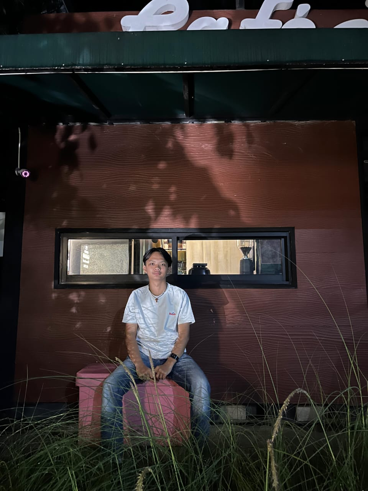

<h1 align="center">Hi 👋, I'm Fransiskus F. Sinaga</h1>
<h3 align="center"> A Frontend Developer</h3>

  

- 👨‍💻 You can also check out my portfolio at [https://rnss24.github.io/](https://Frnss24.github.io/)

- 📫 How to reach me **sinagafrans061@gmail.com**

- ⚡ Fun fact **I think I am funny XD**

<h3 align="left">Connect with me:</h3>

## 🌐 Languages I Frequently Use
- 
- 
- 
- 
- 
- 

## 📈 GitHub Stats

